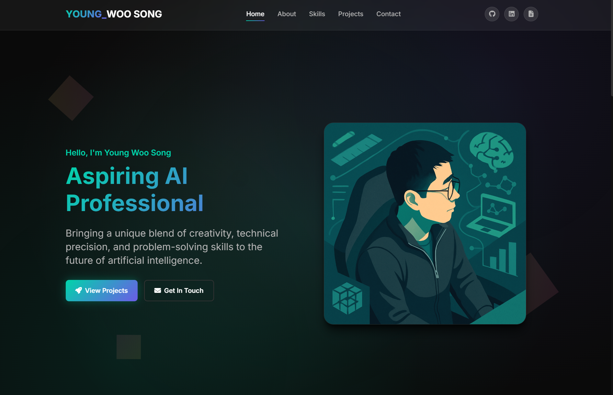

# Young Woo Song – Personal Portfolio Website

## Hello, I'm Young Woo Song  
### Aspiring AI Professional  
Bringing a unique blend of creativity, technical precision, and problem-solving skills to the future of artificial intelligence.

[**CV / Resume**](https://youngwoosongcv.notion.site/Young-Woo-Song-1c964ba2209280bb954ad884c1a11b0f?pvs=74)

---

## Table of Contents

1. [Overview](#overview)  
2. [Features](#features)  
3. [Built With](#built-with)  
4. [Contact](#contact)

---

## Overview

This repository contains the source code for my personal portfolio website.  
Built with **HTML5**, **CSS3**, and **JavaScript (ES6+)**, the site highlights my projects in AI engineering, computer vision, generative models, and full-stack development.  
It is fully responsive, mobile-friendly, and employs modern UI patterns such as dark-mode gradients and glassmorphism.

---

## Features

| Category | Highlights |
| -------- | ---------- |
| **Modern UI** | Dark-mode theme, vibrant gradients, glassmorphism cards |
| **Hero Section** | Bold greeting, subtitle, and CTA button |
| **Responsive Navigation** | Fixed header, smooth-scroll anchors, mobile menu |
| **Skills Showcase** | Categorised tech stack with icons and hover effects |
| **Featured Projects** | Six project cards linking to detailed pages |
| **Scroll Animations** | Fade-up effects via AOS library |
| **Project Pages** | Consistent “Project Hero” layout with screenshots & tech tags |
| **Footer** | Social links to GitHub, LinkedIn, and Notion CV |

---

## Built With

- **HTML5 / CSS3** – custom properties, CSS Grid, Flexbox, glassmorphism  
- **JavaScript (ES6+)** – navigation logic, mobile toggle, smooth scroll  
- **AOS (Animate On Scroll)** – lightweight scroll animations  
- **Font Awesome** – iconography  
- **Project-Specific AI/ML Tools**  
  - Notion MCP Agent · FastMCP · LangChain · GPT-4o  
  - GenAI Image Generation · Stable Diffusion XL · ControlNet  
  - Computer Vision Safety · YOLOv9 · PyTorch · OpenCV  
  - LLM RAG System · Ollama LLaMA 3.1 · ChromaDB  
  - Vision Model RAG · OCR + LLM ensemble  
  - CodeVision Flutter App (coming soon)

---

## Contact

Young Woo Song

Email: youngwoo930@gmail.com

LinkedIn: linkedin.com/in/young-woo-song-145488217

